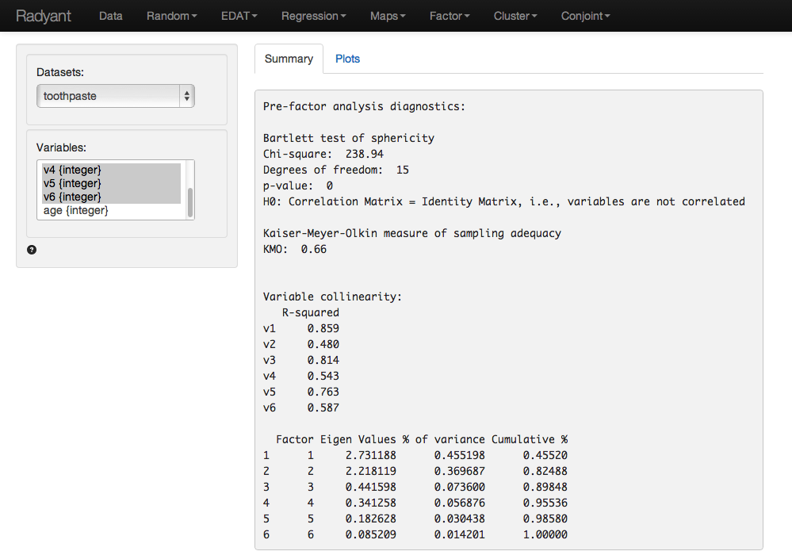
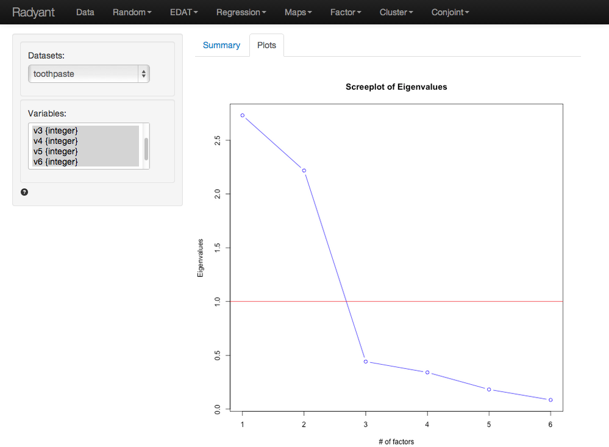

The goal of Factor Analysis is to reduce the dimensionality of the data without significant loss of information. The tool tries to achieve this goal by looking for structure in the correlation matrix of the variables included in the analysis. The researcher will usually try to link each of the original variables to an underlying factor and then provide a descriptive label for each factor (i.e., a name).

# Example: Toothpaste

Click the 'examples' radio button on the Data > Manage page and click 'Load examples' then choose the toothpaste  data from the Datasets dropdown. The data set contains information from 60 consumers who were asked to respond to six questions to determine their attitudes towards toothpaste. The scores shown for variables v1-v6 indicate the level of agreement with the statement indicated on a 7-point scale where 1 = strongly disagree and 7 = strongly agree.

The first step in factor analysis is to determine if the data has the appropriate characteristics for the analysis.
Data that show a limited amount of correlation between the variables of interest are generally not appropriate for factor analysis. We will use three criteria to test if the data are suited for factor analysis:  Bartlett’s test for sphericity, the KMO-test, and Collinearity for each variable

The KMO and Bartlett’ test evaluate all available data together. A KMO value over 0.6 and a significance level for the Bartlett’s test below .05 indicate there is a reasonable amount of correlation in the data. Variable collinearity indicates how strongly a single variable is correlated with all the other variables combined. Values above .4 are considered appropriate.

As can be seen in the output in the Summary tab from Factor > Pre-factor analysis, Bartlett’s test statistic is large and significant (p-value very close to 0) as desired. The Kaiser-Meyer-Olkin (KMO) > 0.6 and thus acceptable. The variable collinearity values are all above 0.4 so all variables can be used in the analysis.

The next step is to determine the number of factors needed to capture structure underlying the data and variables. Factors that do not explain or capture even as much variance in the data as could be expected by chance are generally omitted from further consideration. These factors have eigenvalues < 1 in the output.

A further criteria that is often used to determine the number of factors is the scree-plot. This is a plot of the eigenvalues against the number of factors, in order of extraction. Often a break or 'elbow' is visible in the plot. Factors up to and including this elbow are selected for further analysis, assuming they all have eigenvalues above 1. A set of factors that explain > 70% of the variance in the original data is generally considered acceptable. The eigen values for all factors is shown in the summary tab (see above). This output shows that only two factors have eigen values above 1. The screeplot of the eigen values is shown in the plots tab.

At first glance the Scree Plot seems to suggest that 3 factors should be extracted (i.e., look for the 'elbow'). However, since the eigen value for the third factor is < 1 we choose to extract 2 factors.

In the output in the Summary tab we see that the increase in cumulative % explained variance is small going from 2 to 3 factors (i.e., from 82.49% to 89.85%). This is confirmed by the fact that the eigenvalue for factor 3 is smaller than 1 (= .442). Again, we choose 2 factors. The first 2 factors capture 82% of the variance in the original data which would be considered excellent.
